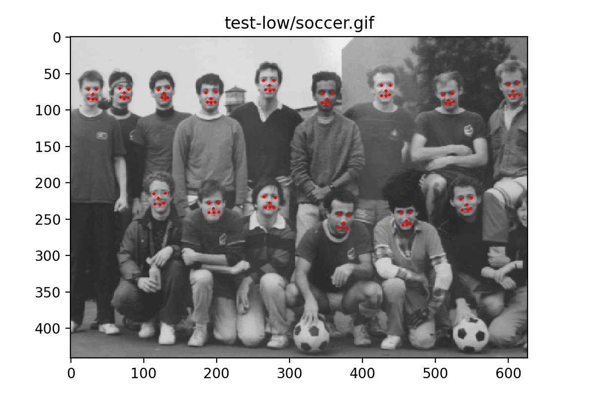

# CMU / MIT Face Dataset



|    name    | #img  | #face |                       source                        |
| :--------: | :---: | :---: | :-------------------------------------------------: |
|   `test`   |  42   |  169  | Henry A. Rowley, Shumeet Baluja, Takeo Kanade (CMU) |
| `test-low` |  23   |  157  |          Kah-Kay Sung, Tomaso Poggio (MIT)          |
| `newtest`  |  65   |  185  | Henry A. Rowley, Shumeet Baluja, Takeo Kanade (CMU) |
| `rotated`  |  50   |  223  | Henry A. Rowley, Shumeet Baluja, Takeo Kanade (CMU) |

```bibtex
@article{rowley1998neural,
  title     = {Neural network-based face detection},
  author    = {Rowley, Henry A and Baluja, Shumeet and Kanade, Takeo},
  journal   = {IEEE Transactions on pattern analysis and machine intelligence},
  volume    = {20},
  number    = {1},
  pages     = {23--38},
  year      = {1998},
  publisher = {IEEE}
}
```


